# LLM-Micro-Architecture

<div align="center">


<p align="center"> <strong>基于 API-Led Connectivity 的微服务架构 AI 智能客服系统</strong>


融合 DDD 领域驱动设计、Saga 分布式事务与 CQRS 读写分离架构 </p>
[✨ 在线演示 (Demo)](#) · [📖 接口文档](#) · [🐛 报告 Bug](../../issues)

</div>

---
## 📖项目简介 (Introduction)
LLM-Knowledge-Assistant 是一个高度工程化的垂直领域 RAG (检索增强生成) 解决方案。

不同于传统的单体 AI 应用，本项目完全遵循**微服务架构**原则，旨在解决大模型应用在复杂企业场景下的数据一致性、高并发检索与服务治理问题。系统采用**Nacos**作为注册配置中心，利用**gRPC**进行高性能内部通信，结合**RabbitMQ**实现事件驱动，并引入**Saga**模式 解决Token计费与服务调用的一致性问题。

### 🔥 核心特性
- **🧠 双脑架构**: rag-engine (编排大脑) 与 vector-service (记忆大脑) 分离，实现高内聚低耦合。

- **🛡️ 完备的服务治理**: 集成 Nacos 实现服务注册发现与配置热更新。

- **⚡ 高性能通信**: 核心链路（如检索、向量化）采用 gRPC (Protobuf)，相比 HTTP JSON 性能提升 10x。

- **🔄 分布式事务**: 采用 Saga (Orchestration) 模式，确保 "LLM 生成" 与 "Token 扣费" 的最终一致性。

- **📚 CQRS 读写分离**: 知识库写入（Knowledge Service）与 问答检索（RAG Engine）分离，通过 MQ 异步解耦。

- **🤖 阿里云百炼驱动**: 底层接入 Qwen-Plus (通义千问) 大模型，提供企业级生成能力。

## 🏗 系统架构(System Architecture)

本系统采用微服务架构，核心组件包括：

- **Gateway Service**: 统一流量入口，负责鉴权与路由。
- **RAG Engine**: 核心编排层，协调检索与生成流程。
- **Vector Service**: 向量数据库接口层 (gRPC)。
- **Knowledge Service**: 知识库写入与处理 (CQRS Write)。
- **Cost Service**: 计费与钱包管理。
- **Infrastructure**: Nacos (注册中心), RabbitMQ (消息队列), Redis (缓存), MySQL (持久化), ChromaDB (向量存储).

### 🧩 关键架构模式应用
**1. Saga 编排模式**:
- **场景: 用户提问 -> 冻结余额 -> RAG 检索 -> LLM 生成 -> 确认扣款 (或失败回滚)。**
- **实现: rag-engine 作为协调者 (Orchestrator)，统一调度 cost-service 和 vector-service。**

**2.CQRS (命令查询职责分离)**：
- **Write (Command): knowledge-service 负责文档解析与切片，通过 RabbitMQ 异步处理。**
- **Read (Query): rag-engine 直接通过 gRPC 调用 vector-service 进行高并发检索。**

**3. Event-Driven**: 
- **使用 RabbitMQ 进行异步解耦（如文档上传后的异步切片处理）。**
---

## 📂 目录结构 (Directory Structure)
```txt
LLM-Knowledge-Assistant/
├── .github                   # GitHub Actions
├── .vscode                   # VSCode 配置
├── backend/                  # 后端微服务集群
│   ├── auth-service/         # [HTTP] 认证服务 (OAuth2/JWT)
│   ├── cost-service/         # [HTTP] 钱包服务 (CQRS Read 端)
│   ├── gateway-service/      # [HTTP] 网关服务 (路由/限流/鉴权)
│   ├── knowledge-service/    # [HTTP/MQ] 知识库服务 (CQRS Write 端)
│   ├── rag-engine/           # [HTTP] 核心编排引擎 (Saga Coordinator)
│   ├── vector-service/       # [gRPC] 向量计算服务 (ChromaDB 封装)
│   ├── shared/               # [Shared Kernel] 共享内核模块
│   │   ├── core/             
│   │   ├── models/           
│   │   ├── rpc/    
│   │   └── telemetry/
│   ├── Dockerfile/           # Dockerfile       
│   └── requirements.txt      # 后端通用依赖
├── deploy/                   # 运维部署配置
│   ├── grafana/              # Grafana 配置
│   ├── prometheus/           # Prometheus 配置
│   ├── .env/                 # 全局环境变量
│   └── docker-compose.yml/   # 容器编排
├── README.md/                # 项目介绍
├── start_all.sh              # 一键启动所有服务
└── test.txt                  # 测试文件
```
## 📦 微服务详细说明
| 服务名称 | 端口 | 技术栈 | 核心职责 |
| :--- | :--- | :--- | :--- |
| **Gateway Service** | 8081 | FastAPI (HTTP) | 统一流量入口，鉴权 (JWT)，限流，路由分发 |
| **Auth Service** | 8003 | FastAPI (HTTP) | 用户认证，OAuth2/JWT 令牌签发，权限控制 |
| **RAG Engine** | 8002 | FastAPI (HTTP) | 业务编排 (Orchestrator)，Saga 事务协调，LLM 调用 |
| **Knowledge Service** | 8001 | FastAPI (HTTP) + RabbitMQ | 知识库管理 (CQRS Write)，文档解析，异步切片入库 |
| **Vector Service** | 50051 | gRPC + ChromaDB | 向量计算与检索服务，封装 ChromaDB 操作 |
| **Cost Service** | 50053 | gRPC + MySQL | 成本控制中心，Token 计费，钱包扣款与回滚 |
| **Frontend** | 5173 | Vue 3 + Vite + TS | 用户交互界面，聊天窗口，知识库管理 |

## 🛠️ 技术栈 (Tech Stack)
| 领域分类 | 核心组件 / 技术 | 详细说明与用途 |
| --- | --- | --- |
| 🏗️ 架构模式 | Microservices | 基于 API-Led Connectivity 的分层微服务架构 |
|  | Saga Pattern | 采用编排式 (Orchestration) 分布式事务，保障 "Token扣费" 与 "LLM生成" 的一致性 |
|  | CQRS | 读写分离：知识库写入 (MQ 异步) vs RAG 检索 (gRPC 直连) |
| 💻 前端交互 | Vue 3 + TypeScript | 采用 Composition API，强类型约束，提升代码可维护性 |
|  | Element Plus | 企业级 UI 组件库，提供完善的暗黑模式支持 |
|  | Axios + SSE | 封装 HTTP 拦截器处理 JWT；使用 Server-Sent Events 实现流式打字机效果 |
|  | Pinia | 轻量级状态管理，用于存储用户会话与权限状态 |
| 🔙 后端服务 | Python 3.12+ | 基础运行环境，全异步 (Async/Await) 编程模式 |
|  | FastAPI | 高性能 Web 框架，自动生成 OpenAPI (Swagger) 文档 |
|  | gRPC + Protobuf | 微服务间的高性能二进制通信 (如 RAG 调用 Vector Service) |
|  | Nacos | 服务注册与发现、动态配置管理 (Config Management) |
|  | RabbitMQ | 异步消息队列，用于知识库文档处理的削峰填谷 |
| 🧠 AI 引擎 | Qwen-Plus | 接入阿里云通义千问 (API)，提供核心推理与生成能力 |
|  | Openai Python SDK + Saga 模式 + Pypdf | RAG 框架基础，负责文档加载 (Loaders)、切片 (Splitters) 与 Prompt 管理 |
|  | text-embedding-v2 | 高维文本向量化模型，用于计算文本相似度 |
| 💾 数据存储 | MySQL 8.0 | 存储核心结构化数据：用户、钱包余额、订单流水 |
|  | Redis | 高速缓存：网关限流 (Rate Limit)、分布式锁、Session 存储 |
|  | ChromaDB | 向量数据库：存储切片后的 Document Embedding |
| 🔭 DevOps | Docker Compose | 全栈容器化编排，实现一键拉起开发环境 |
|  | OpenTelemetry | 可观测性标准，实现全链路 Trace ID 自动透传 |
|  | Jaeger | 分布式链路追踪系统，可视化分析跨服务调用瓶颈 |
|  | Prometheus/Grafana | 实时收集系统指标 (QPS/Latency) 并展示可视化监控大屏 |
|  | GitHub Actions | CI/CD 流水线，自动化执行 Lint 检查、Pytest 测试与镜像构建 |

## 🔒 安全机制（security mechanism）
| 安全层级   | 关键技术/机制                | 防御目标                             |
|------------|-------------------------------|--------------------------------------|
| 网络边界   | Redis 限流, 网关统一路由       | DDoS, 接口滥用, 端口扫描              |
| 应用接入   | OAuth2, JWT, Argon2           | 身份伪造, 撞库攻击, 越权访问          |
| 内部通信   | Internal API Key, gRPC        | 内网横向移动, 服务伪造                |
| 业务逻辑   | Saga 事务, Pydantic 校验      | 资金/Token 盗用, SQL 注入             |
| 模型内容   | System Prompt 约束            | Prompt 注入, 内容幻觉                |

## 📸 系统预览 (Screenshots)
### 前端页面
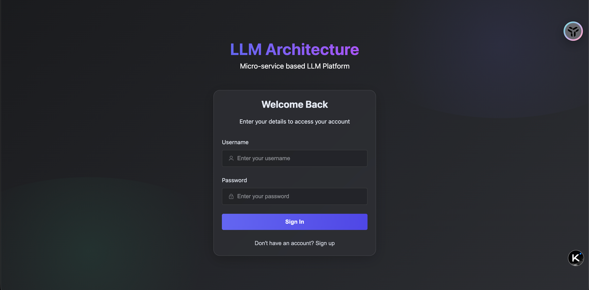
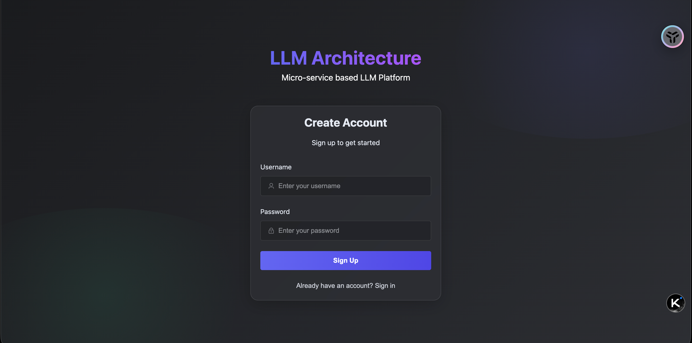
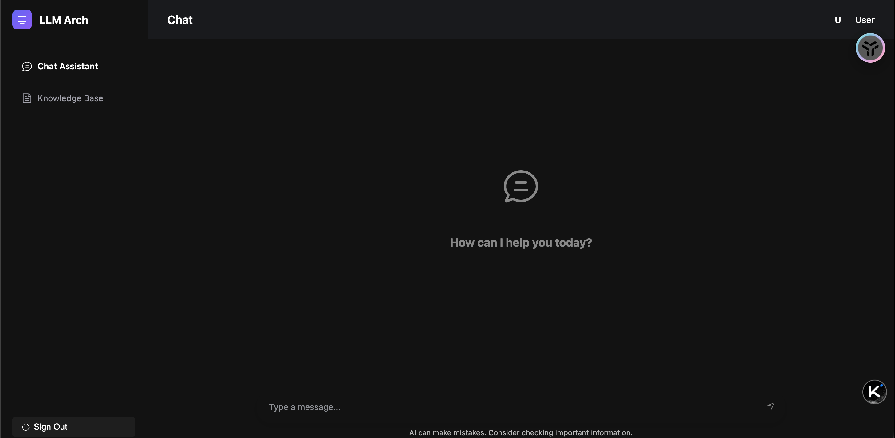
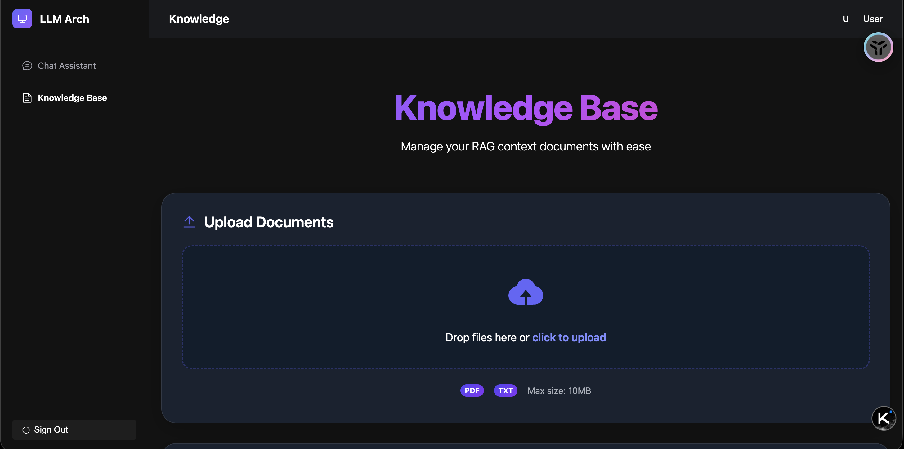
### Nacos
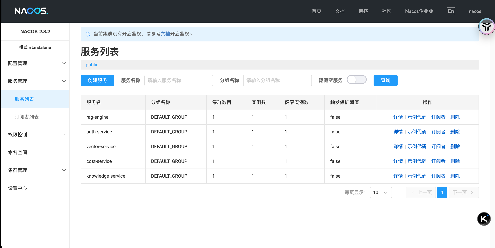
### RabbitMQ
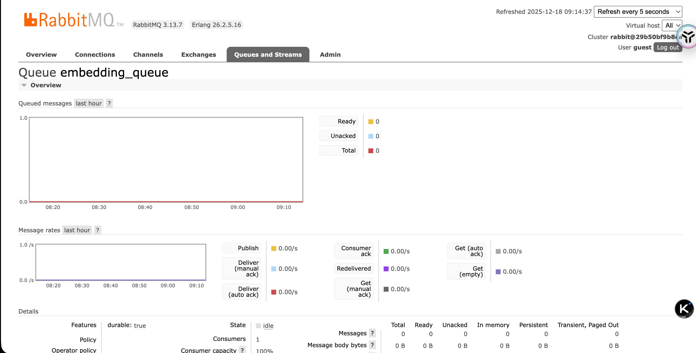
### Grafana
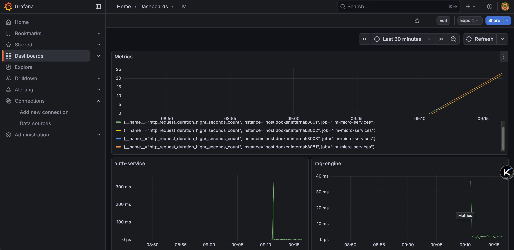
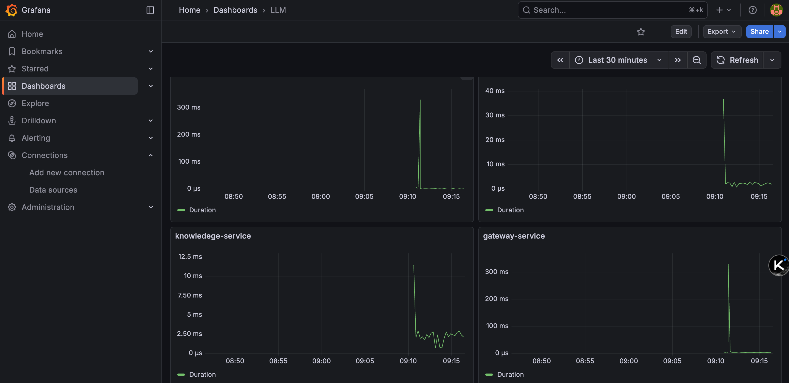
### Jaeger
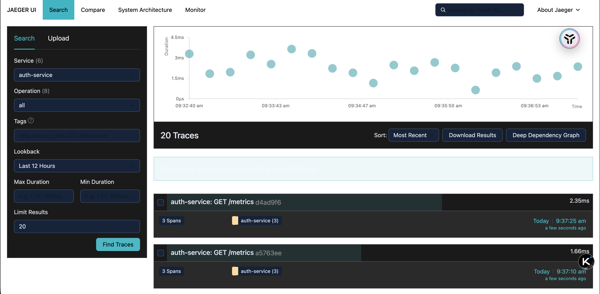
### Gateway Swagger
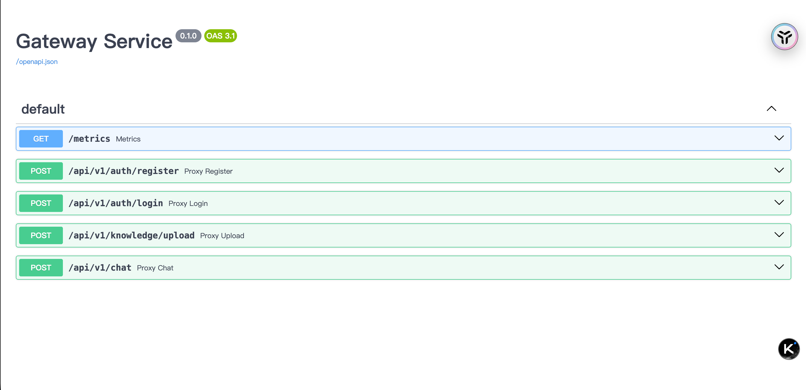
## 系统整体架构拓扑图 (System Architecture Topology)
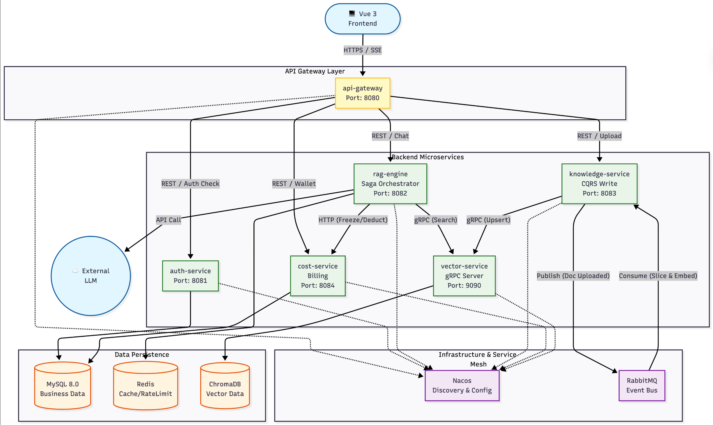
## 核心业务流程图：RAG 对话与 Saga 分布式事务
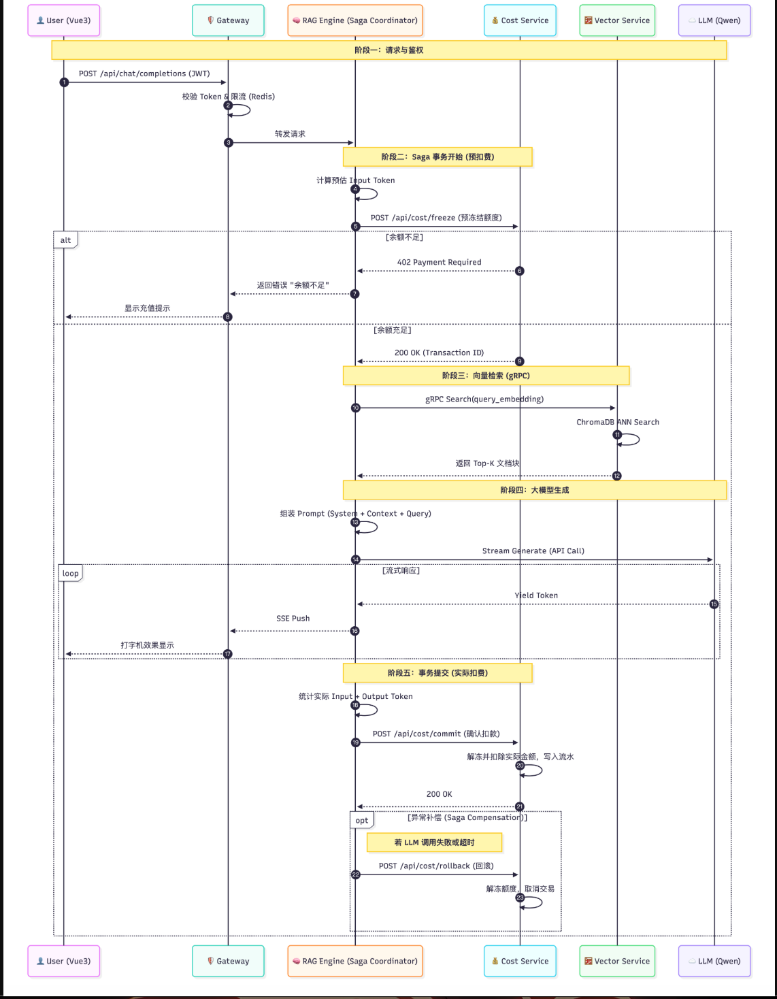
## 🚀 Quick Start (快速开始)

### 前置要求 (Prerequisites)
- **Docker & Docker Compose**: 必须安装。
- **Python 3.12+**: 建议使用 Conda 环境。
- **Node.js 20+**: 前端构建依赖。

### 安装与启动 (Installation & Startup)

1.  **克隆项目**
    ```bash
    git clone <repository_url>
    cd LLM-Micro-Architecture
    ```

2.  **启动基础设施 (Infrastructure)**
    ```bash
    # 启动 MySQL, Redis, Nacos, RabbitMQ, Jaeger, ChromaDB, Prometheus, Grafana
    docker compose -f deploy/docker-compose.yml up -d
    ```

3.  **安装后端依赖**
    ```bash
    # 建议创建虚拟环境
    conda create -n fastapi_env python=3.12
    conda activate fastapi_env
    pip install -r backend/requirements.txt
    ```

4.  **安装前端依赖**
    ```bash
    cd frontend
    npm install
    cd ..
    ```

5.  **一键启动所有服务**
    ```bash
    chmod +x start_all.sh
    ./start_all.sh
    ```
    该脚本将按顺序启动所有微服务及前端开发服务器。

6.  **访问应用**
    - **Frontend UI**: [http://localhost:5173](http://localhost:5173)
    - **Gateway Swagger**: [http://localhost:8081/docs](http://localhost:8081/docs)
---

## 成员贡献
### 孔钦霖 40%
### 潘子晨 12.5%
### 黄俊伟 12.5%
### 胡赟文 12.5%
### 娄世祥 12.5%
### 杨晶   12.5%

